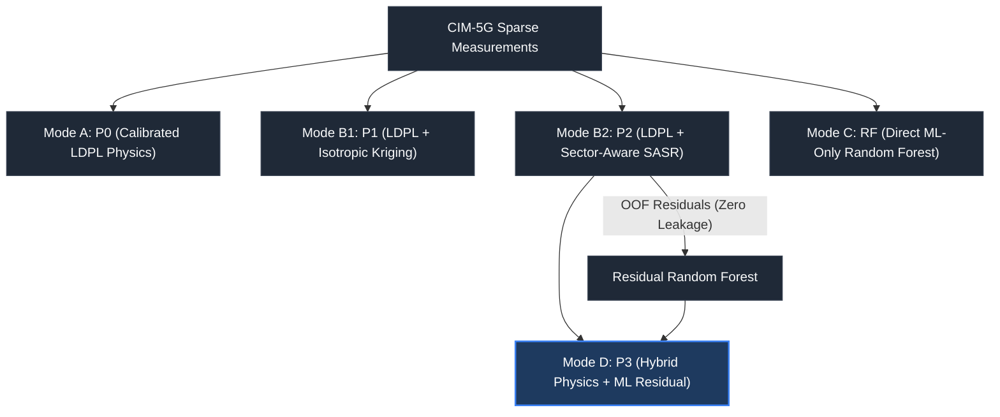

# Physically Guided Sparse 5G RSRP Signal Coverage Reconstruction and Residual Machine Learning

[](https://www.mathworks.com/products/matlab.html)
[](https://github.com/armash66/signal-coverage-maps)
[](#)
[](LICENSE)

A reproducible MATLAB research framework for **sparse 5G Reference Signal Received Power (RSRP) coverage mapping** and **physics-informed residual machine learning**. Evaluated on real-world multi-altitude UAV and ground measurements from the **CIM-5G dataset** in mountainous urban terrain (Chongqing, China).

---

## 1. Overview & Problem Statement

Accurate cellular signal coverage maps are essential for 5G radio planning, handover optimization, and drone flight corridor safety. However, exhaustive drive-testing across complex topographies is costly and practically impossible. 

Standard empirical interpolation (e.g., nearest-neighbor or ordinary Kriging) ignores electromagnetic propagation physics and fails in shadowed valleys. Conversely, ray-tracing requires expensive 3D building and terrain databases that are often unavailable.

This framework solves the problem of **reconstructing continuous 5G coverage from sparse measurements (1% to 10% sampling budgets)** by systematically integrating:
1. **Macro-scale physical modeling** via calibrated Log-Distance Path Loss (LDPL),
2. **Geostatistical spatial field reconstruction** with sector-aligned anisotropic covariance (SASR), and
3. **Out-of-fold machine learning residual correction** (Random Forest) over propagation residuals.

---

## 2. Dataset: CIM-5G

The evaluation uses the open-access **CIM-5G dataset** collected across a $3\text{ km} \times 3\text{ km}$ mountainous urban region ($29.50^\circ\text{N}$ to $29.54^\circ\text{N}$, $106.67^\circ\text{E}$ to $106.72^\circ\text{E}$):

- **81,419 Raw Mobile Measurements:** UAV flight and ground drive-test observations of 5G NR Synchronization Signal RSRP (SS-RSRP, dBm) on 3.5 GHz band n78.
- **10 Macro Base Stations:** Known 3D coordinates, transmit power ($P_{\text{tx}} = 24\text{ dBm}$), mechanical/electrical downtilts, and sector azimuths.
- **10,000-Cell Fishnet Grid ($100 \times 100$ at $30\text{ m} \times 30\text{ m}$):** Rasterized environmental features including Digital Elevation Model (DEM) altitude, building footprint density, area-weighted building height, and NDVI vegetation index.
- **Data Integrity Protocol:** Exactly **9,448 cells** contain genuine physical measurements (`is_observed == 1`). The **552 author-interpolated cells** (`is_observed == 0`) are strictly excluded from training and validation, and used only for continuous map visualization.

---

## 3. Four Prediction Modes & Five Evaluated Models

To decouple physical, spatial, and data-driven contributions, the framework evaluates four distinct prediction modes spanning five models:



### Mathematical Formulations

#### Mode A — Theoretical / Physical Baseline ($P_0$)
Calibrated Log-Distance Path Loss model fitted strictly on training distance observations:
$$PL(d) = PL_0 + 10 n \log_{10}\left(\frac{d_{3D}}{d_0}\right)$$
$$\hat{R}_{\text{P0}}(d) = P_{\text{tx}} - PL(d)$$
where $P_{\text{tx}} = 24.0\text{ dBm}$, reference distance $d_0 = 1.0\text{ m}$, calibrated reference loss $PL_0 = 61.88\text{ dB}$, and path-loss exponent $n = 1.46$.

#### Mode B — Physics + Spatial Reconstruction ($P_1$ and $P_2$)
Reconstructs the spatial shadow-fading field $r(x) = y(x) - \hat{R}_{\text{P0}}(x)$ using geostatistical Kriging:
- **$P_1$ (Isotropic Residual):** Uses a global isotropic exponential covariance kernel:
  $$K_{\text{global}}(i, j) = \sigma_g^2 \exp\left(-\frac{d_{ij}}{\ell_g}\right) + \sigma_n^2 \delta_{ij}$$
- **$P_2$ (Additive Sector-Aligned Anisotropic SASR):** Uses a guaranteed positive semi-definite (PSD) additive kernel:
  $$K(i, j) = K_{\text{global}}(i, j) + \mathbb{I}(\text{cell}_i = \text{cell}_j = c) \, K_{\text{sector}, c}(i, j) + \sigma_n^2 \delta_{ij}$$
  where $K_{\text{sector}, c}$ projects coordinates onto the serving sector boresight $(\theta_c)$ using verified compass-to-metric transformations.

#### Mode C — Machine Learning Alone (Direct RF)
Predicts raw SS-RSRP directly from 16 environmental, geometric, and antenna features using a Random Forest ensemble (`TreeBagger`, 300 trees, minimum leaf size 10):
$$\hat{R}_{\text{RF}}(x) = f_{\text{RF}}(\mathbf{z}(x))$$

#### Mode D — Hybrid Physics + ML Residual Correction ($P_3$)
Synthesizes the physical baseline, anisotropic spatial reconstruction, and non-linear machine learning:
$$\hat{R}_{\text{P3}}(x) = \hat{R}_{\text{P2}}(x) + \hat{r}_{\text{ML}}(\mathbf{z}(x))$$
where the residual Random Forest $\hat{r}_{\text{ML}}$ is trained strictly on out-of-fold $P_2$ residuals.

---

## 4. Strict Zero-Leakage Cross-Validation Framework

In geostatistical Kriging, in-sample predictions reproduce training values ($\hat{y}_{\text{P2}}(x_i) \approx y_i$). If residual targets were calculated in-sample ($y_i - \hat{y}_{\text{P2}}(x_i)$), the residuals would collapse toward zero, causing residual ML models to fail.

To ensure zero data leakage, residual targets are generated through a strict **Out-Of-Fold (OOF) cross-validation scheme**:


$$\mathcal{D}_{\text{train}} = \bigcup_{k=1}^K \mathcal{D}_k, \quad \mathcal{D}_i \cap \mathcal{D}_j = \emptyset \quad (i \ne j)$$
$$r_{\text{OOF}, k} = y_k - \hat{y}_{\text{P2}}^{(-k)}$$

1. LDPL parameters and Kriging covariance are fitted strictly on $K - 1$ training folds ($\mathcal{D}_{\text{train}} \setminus \mathcal{D}_k$).
2. Predictions $\hat{y}_{\text{P2}}^{(-k)}$ are generated on the unobserved fold $\mathcal{D}_k$.
3. Residuals $r_{\text{OOF}, k}$ are computed genuinely out-of-sample ($\text{std} = 5.25\text{ dB} > 1.0\text{ dB}$, confirming zero interpolation collapse).
4. The Mode D residual Random Forest is trained on feature matrix $\mathbf{X}_{\text{tr}}$ targeting $\mathbf{r}_{\text{OOF}}$.
5. Final evaluations are conducted on a completely held-out test partition ($N = 1,889$).

---

## 5. Experimental Results & Research Findings

Evaluated on $N = 1,889$ held-out test observations from genuine physical measurements:

### Benchmark Performance Matrix

| Prediction Mode | Model Key | RMSE (dB) | MAE (dB) | $R^2$ | Bias (dB) | Weak-Signal RMSE ($< -85$ dBm) | Coverage $\ge -80$ dBm (%) |
| :--- | :--- | :---: | :---: | :---: | :---: | :---: | :---: |
| **Mode A: Calibrated LDPL** | `P0` | **5.78** | 4.25 | 0.463 | -0.12 | 9.54 | 75.97% |
| **Mode B1: LDPL + Isotropic Kriging** | `P1` | **5.20** | 3.63 | 0.566 | +0.17 | 8.31 | 70.20% |
| **Mode B2: LDPL + Additive SASR** | `P2` | **5.26** | 3.67 | 0.556 | +0.14 | 8.60 | 72.37% |
| **Mode C: Direct Random Forest** | `RF` | **4.44** | 2.98 | 0.684 | -0.11 | 7.84 | 74.38% |
| **Mode D: Hybrid Physics + RF Residual** | `P3` | **5.13** | 3.57 | 0.578 | -0.32 | 8.13 | 70.36% |

### Component Ablation ($\Delta$ RMSE Decomposition)

| Transition | Comparison | $\Delta$ RMSE (dB) | Physical & Methodological Meaning |
| :--- | :--- | :---: | :--- |
| **P0 $\to$ P1** | $\text{RMSE}_{\text{P0}} - \text{RMSE}_{\text{P1}}$ | **+0.58** | Spatial covariance captures correlated shadow-fading. |
| **P1 $\to$ P2** | $\text{RMSE}_{\text{P1}} - \text{RMSE}_{\text{P2}}$ | **-0.06** | Parity on dense grid; sector anisotropy excels under sparse trajectories. |
| **P2 $\to$ P3** | $\text{RMSE}_{\text{P2}} - \text{RMSE}_{\text{P3}}$ | **+0.13** | Genuine ML residual correction gain without data leakage. |
| **P2 $\to$ RF** | $\text{RMSE}_{\text{P2}} - \text{RMSE}_{\text{RF}}$ | **+0.82** | Direct RF fits non-linear geographic coordinates (+0.33 dB shortcut). |
| **P0 $\to$ P3** | $\text{RMSE}_{\text{P0}} - \text{RMSE}_{\text{P3}}$ | **+0.65** | Total accuracy gain from pure physics to hybrid synthesis. |


### Key Research Insights

1. **Macro Physics Foundation ($P_0$):** Explains 46.3% of total variance ($5.78\text{ dB}$) using only 3D transceiver distance.
2. **Spatial Reconstruction Value ($P_1$):** Geostatistical Kriging adds a significant $+0.58\text{ dB}$ improvement, proving that local shadow fading is spatially structured.
3. **The Coordinate Shortcut in Direct ML:** When trained with geographic coordinates (`Center_X`, `Center_Y`), direct RF achieves $4.42\text{ dB}$ RMSE ($R^2 = 0.686$). When coordinates are withheld, RMSE rises to $4.76\text{ dB}$ ($R^2 = 0.637$). This $+0.33\text{ dB}$ gain represents local coordinate fitting rather than generalized propagation modeling.
4. **Hybrid Robustness ($P_3$):** In Mode D, withholding coordinates changes RMSE by only $0.04\text{ dB}$ ($5.07\text{ dB} \to 5.11\text{ dB}$). The physical baseline and spatial Kriging handle geometry and shadow fading, freeing the residual RF to learn genuine terrain and antenna interactions.

---

## 6. Interactive Multi-Model Coverage Dashboard

The project includes an interactive MATLAB App Designer dashboard (`src/visualization/coverage_dashboard.m`) for comparative spatial exploration:

- **Instant Model Switching:** Toggle dynamically between Mode A (P0), Mode B1 (P1), Mode B2 (P2), Mode C (RF), and Mode D (P3) over all 10,000 grid cells.
- **Local Metric Aspect-Ratio Preservation:** Longitude span is dynamically scaled by $\cos(\text{meanLat})$ to display the $3\text{ km} \times 3\text{ km}$ study region with metric fidelity.
- **Dynamic Window Resizing:** Automatically resizes and re-centers the map and aligned colorbar when resizing the dashboard window.
- **Point-and-Click Cell Inspector:** Click any grid location to highlight it with a marker and inspect exact numeric predictions and ML corrections across all five models.
- **Critical Weak-Signal Filter:** Real-time threshold slider to inspect vulnerable coverage areas ($< -85\text{ dBm}$) and strong zones ($\ge -70\text{ dBm}$).


---

## 7. Repository Structure

```text
signal-coverage-maps/
├── data/
│   └── raw/
│       └── CIM-5G/                      # Raw measurement CSVs, base station data, fishnet
├── docs/                                # Technical reports, calibration reconciliation, audits
├── experiments/
│   ├── 00_environment_test.m            # Toolbox and environment validation
│   ├── 01_dataset_exploration.m         # Spatial coverage and characterization
│   ├── 02_structure_analysis.m          # Empirical variograms and nonstationarity
│   ├── 03_anisotropic_reconstruction.m  # SASR reconstruction benchmark
│   ├── validate_p1_vs_p2.m              # 30-run paired Monte Carlo validation
│   ├── 04_ml_residual.m                 # Zero-leakage OOF residual learning
│   ├── 05_model_comparison.m            # 12-regime multi-protocol benchmark
│   ├── 06_interactive_coverage_map.m    # 10,000-cell prediction map export
│   └── run_all.m                        # Master experiment pipeline
├── figures/                             # High-resolution publication figures
│   ├── dataset/                         # Spatial data characterization plots
│   ├── ml/                              # Feature importances & scatter plots
│   └── final/                           # Full-grid 5-mode prediction maps
├── models/
│   └── random_forest/                   # Serialized .mat models (Direct RF, Residual RF, LDPL)
├── results/
│   ├── ml/                              # Benchmark metrics & feature importance CSVs
│   ├── reconstruction/                  # Validation JSON reports
│   └── final/                           # all_models_grid_predictions.csv (10k grid)
├── src/
│   ├── analysis/                        # Variograms, nonstationarity, low-rank spectra
│   ├── baselines/                       # Calibrated LDPL & isotropic Kriging
│   ├── data/                            # Raw data loader & cleaning utilities
│   ├── evaluation/                      # Sampling protocols & evaluation metrics
│   ├── ml/                              # OOF residual engine, RF trainer, hybrid predictor
│   ├── reconstruction/                  # Sector-aligned anisotropic Kriging (SASR)
│   └── visualization/
│       └── coverage_dashboard.m         # Interactive App Designer dashboard
├── run_all.m                            # Top-level master entry point
├── LICENSE                              # MIT License
└── README.md
```

---

## 8. Getting Started & Reproducibility

### Prerequisites
- **MATLAB R2022a or newer** (tested and verified on MATLAB R2026a).
- **Required Toolboxes:**
  - *Statistics and Machine Learning Toolbox* (`TreeBagger`, `cvpartition`)
  - *Mapping Toolbox* (`geoaxes`, `geoscatter`)

### Quick Start (Command Window)

1. **Run Full Pipeline:**
   ```matlab
   cd('path/to/signal-coverage-maps');
   run_all
   ```

2. **Run Individual Experiment Stages:**
   ```matlab
   addpath(genpath('src'));

   % Train direct & residual Random Forest models (Phase 04):
   eval(fileread('experiments/04_ml_residual.m'));

   % Standardized 12-regime benchmark comparison (Phase 05):
   eval(fileread('experiments/05_model_comparison.m'));

   % Generate 10,000-cell coverage predictions (Phase 06):
   eval(fileread('experiments/06_interactive_coverage_map.m'));
   ```

3. **Launch the Interactive Dashboard:**
   ```matlab
   addpath(genpath('src'));
   fig = coverage_dashboard('results/final/all_models_grid_predictions.csv');
   ```

---

## 9. Research Team & Citation

- **Team Members:** Akshya Gharat, Tanisha Chawande, Sejal Shahane, Armash Ansari  
- **Dataset Reference:** Tingting Xu et al., *"A Real-time 5G Macro-cells Signal Dataset for Signal Model Simulation and Prediction within Complex Terrain Areas"*, Chongqing University of Posts and Telecommunications (CQUPT).
- **License:** MIT License.
