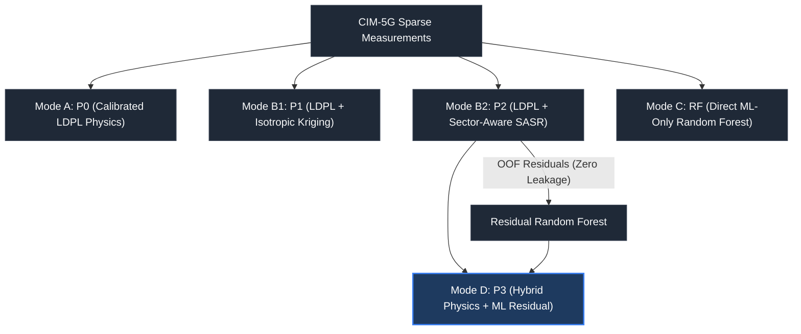
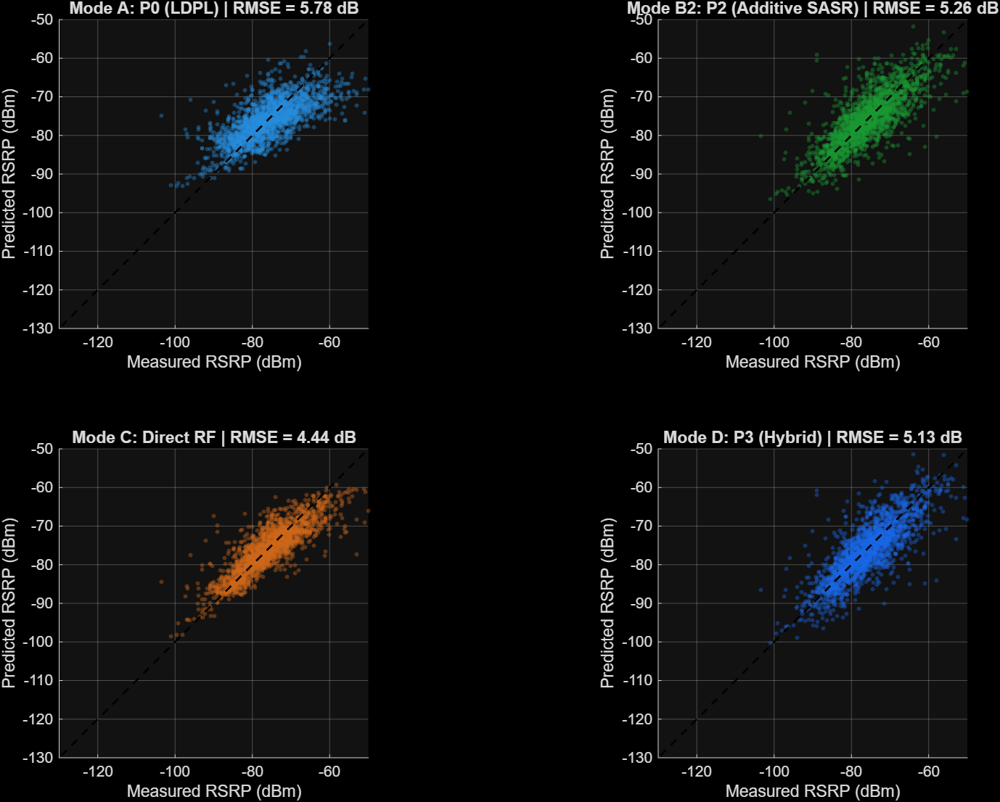
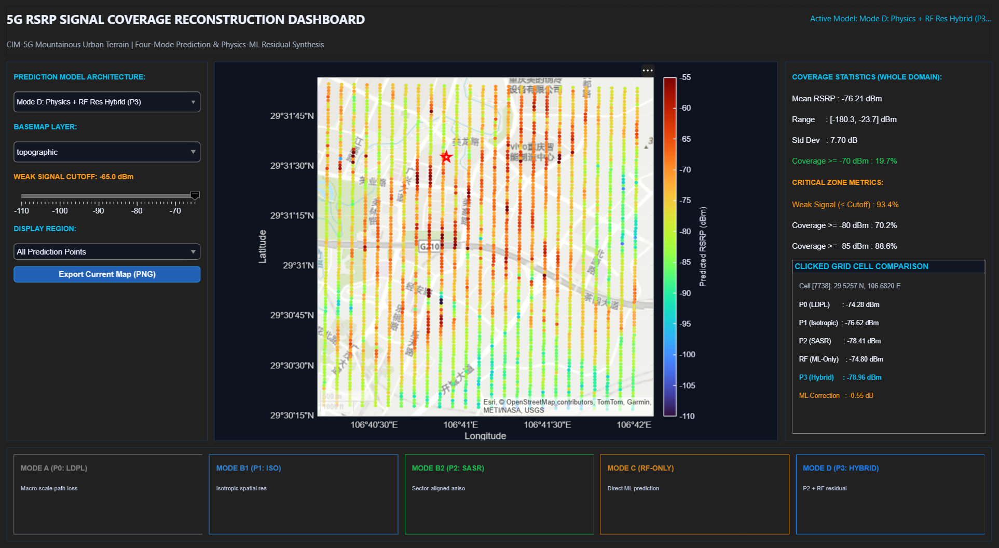

# Physically Guided Sparse 5G RSRP Signal Coverage Reconstruction and Residual Machine Learning

[](https://www.mathworks.com/products/matlab.html)
[](https://github.com/armash66/signal-coverage-maps)
[](#)
[](LICENSE)

A reproducible MATLAB research framework for **sparse 5G Reference Signal Received Power (RSRP) coverage mapping** and **physics-informed residual machine learning**. Evaluated on real-world multi-altitude UAV and ground measurements from the **CIM-5G dataset** in mountainous urban terrain (Chongqing, China).

---

## Overview & Problem Statement

Accurate cellular signal coverage maps are essential for 5G radio planning, handover optimization, and drone flight corridor safety. However, exhaustive drive-testing across complex topographies is costly and practically impossible. 

Standard empirical interpolation (e.g., nearest-neighbor or ordinary Kriging) ignores electromagnetic propagation physics and fails in shadowed valleys. Conversely, ray-tracing requires expensive 3D building and terrain databases that are often unavailable.

This framework solves the problem of **reconstructing continuous 5G coverage from sparse measurements (1% to 10% sampling budgets)** by systematically integrating:
1. **Macro-scale physical modeling** via calibrated Log-Distance Path Loss (LDPL)
2. **Geostatistical spatial field reconstruction** with sector-aligned anisotropic covariance (SASR)
3. **Out-of-fold machine learning residual correction** (Random Forest) over propagation residuals

> 📄 **Full mathematical formulations** are documented in [docs/methodology.md](docs/methodology.md).

---

## Dataset: CIM-5G

The evaluation uses the open-access **CIM-5G dataset** collected across a 3 km × 3 km mountainous urban region (29.50°N to 29.54°N, 106.67°E to 106.72°E):

- **81,419 Raw Mobile Measurements:** UAV flight and ground drive-test observations of 5G NR Synchronization Signal RSRP (SS-RSRP, dBm) on 3.5 GHz band n78.
- **10 Macro Base Stations:** Known 3D coordinates, transmit power (24 dBm), mechanical/electrical downtilts, and sector azimuths.
- **10,000-Cell Fishnet Grid (100 × 100 at 30 m × 30 m):** Rasterized environmental features including DEM altitude, building footprint density, area-weighted building height, and NDVI vegetation index.
- **Data Integrity Protocol:** Exactly **9,448 cells** contain genuine physical measurements. The **552 author-interpolated cells** are strictly excluded from training and validation, and used only for continuous map visualization.

> 📄 **Detailed characterization** in [docs/dataset_exploration.md](docs/dataset_exploration.md).

---

## Prediction Modes

The framework evaluates **four prediction modes** spanning **five models**, each isolating a specific contribution layer:

| Mode | Model | Description |
| :--- | :---: | :--- |
| **Mode A** | `P0` | Calibrated Log-Distance Path Loss (physics-only baseline) |
| **Mode B1** | `P1` | LDPL + Isotropic Kriging (global spatial correction) |
| **Mode B2** | `P2` | LDPL + Sector-Aligned Anisotropic SASR (directional spatial correction) |
| **Mode C** | `RF` | Direct Random Forest on 16 environmental features (ML-only baseline) |
| **Mode D** | `P3` | Hybrid Physics + Geostatistics + ML Residual Correction |



> 📄 **Mathematical formulations & cross-validation framework** in [docs/methodology.md](docs/methodology.md).

---

## Results

Evaluated on N = 1,889 held-out test observations from genuine physical measurements:

| Prediction Mode | Model | RMSE (dB) | MAE (dB) | R² | Bias (dB) |
| :--- | :---: | :---: | :---: | :---: | :---: |
| **Mode A: Calibrated LDPL** | `P0` | 5.78 | 4.25 | 0.463 | −0.12 |
| **Mode B1: LDPL + Isotropic Kriging** | `P1` | 5.20 | 3.63 | 0.566 | +0.17 |
| **Mode B2: LDPL + Additive SASR** | `P2` | 5.26 | 3.67 | 0.556 | +0.14 |
| **Mode C: Direct Random Forest** | `RF` | **4.44** | **2.98** | **0.684** | −0.11 |
| **Mode D: Hybrid Physics + RF** | `P3` | 5.13 | 3.57 | 0.578 | −0.32 |

### Key Findings

- **Physics Foundation (P₀):** Explains 46.3% of total variance using only 3D transceiver distance.
- **Spatial Reconstruction (P₁):** Geostatistical Kriging adds +0.58 dB RMSE improvement — shadow fading is spatially structured.
- **Coordinate Shortcut in ML:** Direct RF gains +0.33 dB from geographic coordinate fitting; the hybrid model is robust to coordinate removal (only 0.04 dB change).
- **Hybrid Robustness (P₃):** Physical baseline + Kriging handle geometry; the residual RF learns genuine terrain interactions.



> 📄 **Full results with ablation analysis** in [docs/results.md](docs/results.md).

---

## Interactive Coverage Dashboard

The project includes an interactive MATLAB App Designer dashboard (`src/visualization/coverage_dashboard.m`) for comparative spatial exploration:

- **Instant Model Switching:** Toggle dynamically between all five prediction modes over all 10,000 grid cells.
- **Local Metric Aspect-Ratio Preservation:** Longitude span scaled by cos(meanLat) for metric fidelity.
- **Dynamic Window Resizing:** Auto-resizes map and colorbar on window resize.
- **Point-and-Click Cell Inspector:** Click any grid cell to inspect exact predictions across all models.
- **Critical Weak-Signal Filter:** Real-time threshold slider for coverage area analysis.



---

## Repository Structure

```text
signal-coverage-maps/
├── data/
│   └── raw/
│       └── CIM-5G/                      # Raw measurement CSVs, base station data, fishnet
├── docs/                                # Technical documentation (see docs/README.md)
│   ├── methodology.md                   # Mathematical formulations & cross-validation
│   ├── results.md                       # Benchmark results & research findings
│   ├── dataset_exploration.md           # CIM-5G spatial characterization
│   ├── anisotropic_reconstruction.md    # SASR kernel derivation
│   ├── ml_integration_report.md         # Full ML pipeline architecture
│   └── ...                              # Additional audits & reports
├── experiments/
│   ├── 00_environment_test.m            # Toolbox and environment validation
│   ├── 01_dataset_exploration.m         # Spatial coverage and characterization
│   ├── 02_structure_analysis.m          # Empirical variograms and nonstationarity
│   ├── 03_anisotropic_reconstruction.m  # SASR reconstruction benchmark
│   ├── validate_p1_vs_p2.m              # 30-run paired Monte Carlo validation
│   ├── 04_ml_residual.m                 # Zero-leakage OOF residual learning
│   ├── 05_model_comparison.m            # 12-regime multi-protocol benchmark
│   ├── 06_interactive_coverage_map.m    # 10,000-cell prediction map export
│   └── run_all.m                        # Master experiment pipeline
├── figures/                             # High-resolution publication figures
│   ├── dataset/                         # Spatial data characterization plots
│   ├── ml/                              # Feature importances & scatter plots
│   └── final/                           # Full-grid 5-mode prediction maps
├── models/
│   └── random_forest/                   # Serialized .mat models (Direct RF, Residual RF, LDPL)
├── results/
│   ├── ml/                              # Benchmark metrics & feature importance CSVs
│   ├── reconstruction/                  # Validation JSON reports
│   └── final/                           # all_models_grid_predictions.csv (10k grid)
├── src/
│   ├── analysis/                        # Variograms, nonstationarity, low-rank spectra
│   ├── baselines/                       # Calibrated LDPL & isotropic Kriging
│   ├── data/                            # Raw data loader & cleaning utilities
│   ├── evaluation/                      # Sampling protocols & evaluation metrics
│   ├── ml/                              # OOF residual engine, RF trainer, hybrid predictor
│   ├── reconstruction/                  # Sector-aligned anisotropic Kriging (SASR)
│   └── visualization/
│       └── coverage_dashboard.m         # Interactive App Designer dashboard
├── run_all.m                            # Top-level master entry point
├── LICENSE                              # MIT License
└── README.md
```

---

## Getting Started

### Prerequisites
- **MATLAB R2022a or newer** (tested on R2026a)
- **Required Toolboxes:**
  - *Statistics and Machine Learning Toolbox* (`TreeBagger`, `cvpartition`)
  - *Mapping Toolbox* (`geoaxes`, `geoscatter`)

### Quick Start

**Run the full pipeline:**
```matlab
cd('path/to/signal-coverage-maps');
run_all
```

**Run individual experiment stages:**
```matlab
addpath(genpath('src'));

% Train direct & residual Random Forest models (Phase 04):
eval(fileread('experiments/04_ml_residual.m'));

% Standardized 12-regime benchmark comparison (Phase 05):
eval(fileread('experiments/05_model_comparison.m'));

% Generate 10,000-cell coverage predictions (Phase 06):
eval(fileread('experiments/06_interactive_coverage_map.m'));
```

**Launch the interactive dashboard:**
```matlab
addpath(genpath('src'));
fig = coverage_dashboard('results/final/all_models_grid_predictions.csv');
```

---

## Documentation

For detailed technical documentation, see the [docs/](docs/) directory:

| Document | Contents |
| :--- | :--- |
| [Methodology](docs/methodology.md) | Mathematical formulations, prediction modes, cross-validation |
| [Results](docs/results.md) | Benchmark performance, ablation analysis, research insights |
| [Dataset Exploration](docs/dataset_exploration.md) | CIM-5G spatial and physical characterization |
| [SASR Reconstruction](docs/anisotropic_reconstruction.md) | Sector-aligned anisotropic kernel derivation |
| [ML Integration](docs/ml_integration_report.md) | Full ML pipeline architecture and audit |

---

## Research Team & Citation

- **Team Members:** Akshya Gharat, Tanisha Chawande, Sejal Shahane, Armash Ansari  
- **Dataset Reference:** Tingting Xu et al., *"A Real-time 5G Macro-cells Signal Dataset for Signal Model Simulation and Prediction within Complex Terrain Areas"*, Chongqing University of Posts and Telecommunications (CQUPT).
- **License:** MIT License.
