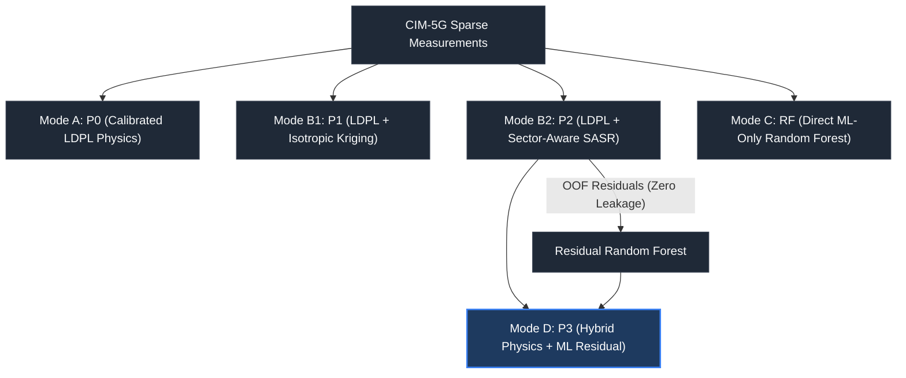

# Mathematical Methodology & Prediction Modes

**Project Title:** Signal Coverage Maps Using Measurements and Machine Learning  
**Dataset:** CIM-5G (Chongqing 5G UAV & Ground Measurement Dataset)  

---

## Four Prediction Modes & Five Evaluated Models

To decouple physical, spatial, and data-driven contributions, the framework evaluates four distinct prediction modes spanning five models:

---

## Mathematical Formulations

### Mode A — Theoretical / Physical Baseline (P₀)

Calibrated Log-Distance Path Loss model fitted strictly on training distance observations:

$$
PL(d) = PL_0 + 10 n \log_{10}\!\left(\frac{d_{3D}}{d_0}\right)
$$

$$
\hat{R}_{\text{P0}}(d) = P_{\text{tx}} - PL(d)
$$

where:
- P_tx = 24.0 dBm (transmit power)
- d₀ = 1.0 m (reference distance)
- PL₀ = 61.88 dB (calibrated reference loss)
- n = 1.46 (path-loss exponent)

### Mode B — Physics + Spatial Reconstruction (P₁ and P₂)

Reconstructs the spatial shadow-fading field using geostatistical Kriging:

$$
r(x) = y(x) - \hat{R}_{\text{P0}}(x)
$$

**P₁ (Isotropic Residual):** Uses a global isotropic exponential covariance kernel:

$$
K_{\text{global}}(i, j) = \sigma_g^2 \exp\!\left(-\frac{d_{ij}}{\ell_g}\right) + \sigma_n^2 \delta_{ij}
$$

**P₂ (Additive Sector-Aligned Anisotropic SASR):** Uses a guaranteed positive semi-definite (PSD) additive kernel:

$$
K(i, j) = K_{\text{global}}(i, j) + \mathbb{1}[\text{cell}_i = \text{cell}_j = c] \; K_{\text{sector}, c}(i, j) + \sigma_n^2 \delta_{ij}
$$

where K_sector,c projects coordinates onto the serving sector boresight (θ_c) using verified compass-to-metric transformations. See [anisotropic_reconstruction.md](anisotropic_reconstruction.md) for the full SASR kernel derivation.

### Mode C — Machine Learning Alone (Direct RF)

Predicts raw SS-RSRP directly from 16 environmental, geometric, and antenna features using a Random Forest ensemble (`TreeBagger`, 300 trees, minimum leaf size 10):

$$
\hat{R}_{\text{RF}}(x) = f_{\text{RF}}(\mathbf{z}(x))
$$

### Mode D — Hybrid Physics + ML Residual Correction (P₃)

Synthesizes the physical baseline, anisotropic spatial reconstruction, and non-linear machine learning:

$$
\hat{R}_{\text{P3}}(x) = \hat{R}_{\text{P2}}(x) + \hat{r}_{\text{ML}}(\mathbf{z}(x))
$$

where the residual Random Forest r̂_ML is trained strictly on out-of-fold P₂ residuals.

---

## Strict Zero-Leakage Cross-Validation Framework

In geostatistical Kriging, in-sample predictions reproduce training values (ŷ_P2(x_i) ≈ y_i). If residual targets were calculated in-sample (y_i − ŷ_P2(x_i)), the residuals would collapse toward zero, causing residual ML models to fail.

To ensure zero data leakage, residual targets are generated through a strict **Out-Of-Fold (OOF) cross-validation scheme**:

**Formal definition:**

$$
\mathcal{D}_{\text{train}} = \bigcup_{k=1}^K \mathcal{D}_k, \quad \mathcal{D}_i \cap \mathcal{D}_j = \emptyset \quad (i \ne j)
$$

$$
r_{\text{OOF}, k} = y_k - \hat{y}_{\text{P2}}^{(-k)}
$$

### OOF Protocol Steps

1. LDPL parameters and Kriging covariance are fitted strictly on K − 1 training folds (D_train \ D_k).
2. Predictions ŷ_P2^(−k) are generated on the unobserved fold D_k.
3. Residuals r_OOF,k are computed genuinely out-of-sample (std = 5.25 dB > 1.0 dB, confirming zero interpolation collapse).
4. The Mode D residual Random Forest is trained on feature matrix **X**_tr targeting **r**_OOF.
5. Final evaluations are conducted on a completely held-out test partition (N = 1,889).

---

## Related Documentation

- [Anisotropic Reconstruction (SASR)](anisotropic_reconstruction.md) — Full SASR kernel derivation and ablation
- [ML Integration Report](ml_integration_report.md) — Complete ML pipeline architecture
- [Dataset Exploration](dataset_exploration.md) — Spatial and physical characterization
- [Structure Analysis](structure_analysis.md) — Empirical variograms and nonstationarity
